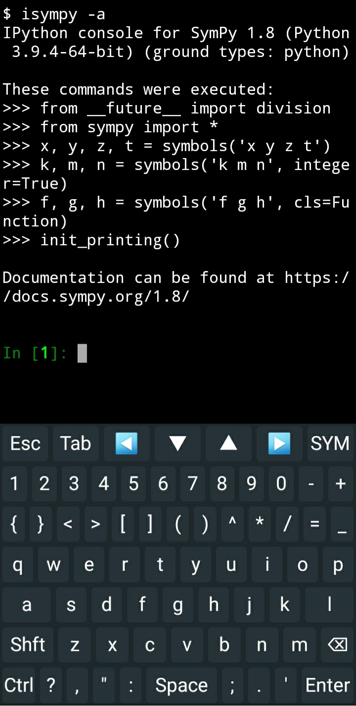
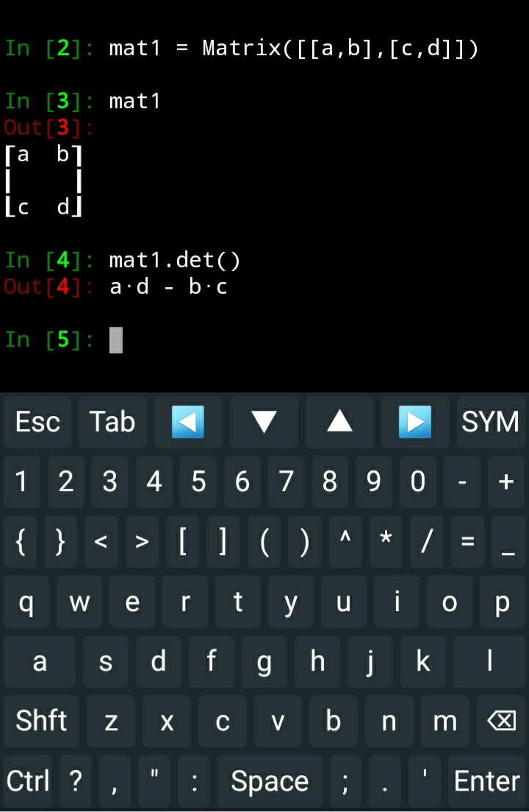

# How to set up your mobile phone with Sympy to use as an engineering calculator

In many engineering disciplines, students have to solve problems that are not necessarily numeric. For example, they have to compute the determinant of a matrix that has some non-numeric elements. For this reason, symbolic libraries are the best tool to use. Since nowadays all people have powerful mobile phones, I will show you how you can use your mobile as an engineering calculator like Casio Classpad or TI calculator. Although Classpad has an app on google play, it has limited features that want you to sign up first; besides, it does not have a perfect UI. You can also install Julia on Termux, and you can use QuickEdit text editor, but those apps are not discussed here.
#### step 1:

Install Termux from google play

#### step 2:

Install CodeBoard from google play

#### step 3:

Open Termux, and wait for the installation to complete. Then to update the packages type the following command.
```$ pkg upgrade```

#### step 4:

Now you should update pip package manager first:
```$ pip install –upgrade pip```

#### step 5:

Now install all the Python packages needed:
```$ pkg install python sympy ipython```

#### step 6:

now instead of importing sympy and then defining every single symbol, you can easily start isympy with -a flag to automatically create missing symbols.
```$ isympy -a```



